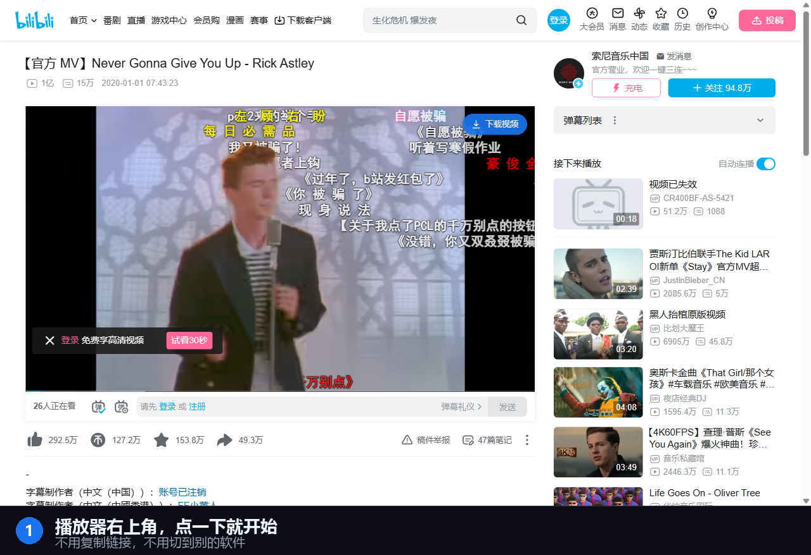
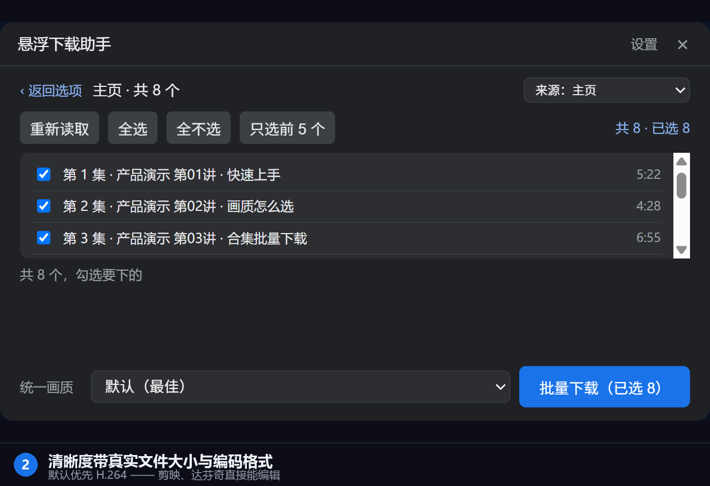
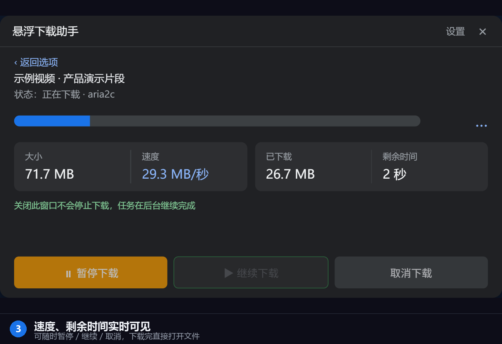
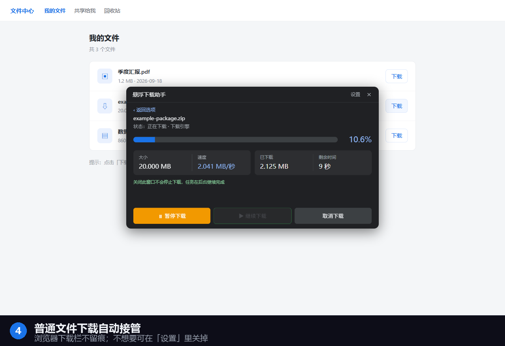
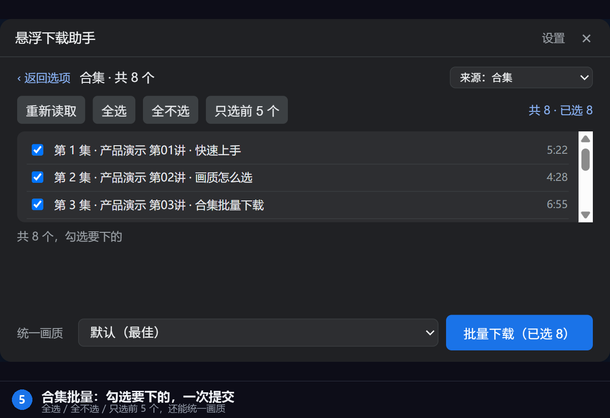

# 悬浮下载助手

**在网页上看到想留的视频或文件，点一下就下。**
不用复制链接，不用开别的软件，不用在被窝里等进度。

[⬇️ 下载安装包](../../releases/latest)　·　[🐞 反馈问题](../../issues/new/choose)　·　[❓ 常见问题](#常见问题)

---

## 它解决什么问题

从网页上存一个视频，正常流程是这样的：

> 复制链接 → 打开另一个下载软件 → 粘贴 → 选画质 → 等它解析 → 找文件在哪 → 拖进剪辑软件

**悬浮下载助手把它压成一步：在播放器右上角点一下。**

而且它专门照顾剪辑的人：**默认优先下载 H.264 格式**，导进剪映、达芬奇、Premiere 能直接编辑，不用先转码。

---

## 支持的网站

### 深度适配（专门做过优化）

| 站点 | 具体支持 |
|---|---|
| **B站** | 画质列表（带真实大小与编码）、**合集 / 分P / 系列**、**UP主主页**、播放列表 |
| **YouTube** | 画质列表、播放列表、频道页 |

### 通用能力（不限于上面两个站点）

- **普通文件**：任何网站的下载链接都能接管，跟站点无关。
- **视频嗅探**：对页面里的媒体流做嗅探兜底 —— 其他视频站点也有机会下到。
  成功率取决于站点结构；**下不到时会明确提示，不会假装成功**。

### 其他平台

抖音 / 快手 / 小红书 / 视频号等**正在适配中**，目前属于「有机会下到、但不保证」。
如果你想让某个平台优先支持，欢迎到 [Issues](../../issues/new/choose) 点名 —— 反馈多的平台会排在前面。

---

## 能下载什么

| 类型 | 说明 |
|---|---|
| **视频（可选画质）** | 列出该视频所有可用清晰度，带真实文件大小与编码格式；**默认优先 H.264**，剪映 / 达芬奇拿到就能直接编辑 |
| **仅音频** | 同一视频可只取音轨 |
| **合集 / 分P / 播放列表** | 一次勾选多集，统一画质，批量提交；下载中可全部暂停 / 继续 / 取消 |
| **普通文件** | zip / exe / pdf / 图片 / 安装包等，任意网站的下载链接 |
| **粘贴链接** | 不想开网页也行，把链接粘进面板即可 |

> **关于画质**：实际可选档位由源站提供什么决定。扩展只列出**真实存在**的档位，
> 读不到就如实显示「未读取到可选档位」，**不会猜一个数字糊弄你**。

---

## 功能

### 1. 视频页悬浮按钮

打开视频页面，播放器右上角出现「下载视频」按钮，点一下就能选画质开始下载。

### 2. 画质可选，剪辑友好

列出该视频所有可用清晰度，**带真实文件大小和编码格式**，你可以按需挑。

默认优先 H.264 —— 剪映、达芬奇拿到就能用。

### 3. 实时进度，速度看得见

进度、速度、剩余时间一目了然；支持暂停 / 继续 / 取消。下载完成可直接「打开文件」或「打开所在文件夹」。

### 4. 普通文件自动接管

在网页上点下载，浏览器自带的那一份会被本机下载器接手 —— **浏览器下载栏里不留记录**。

不想要这个行为？在扩展面板右上角「设置」里取消勾选「接管浏览器下载」即可，之后所有普通文件下载都按浏览器原样进行。

### 5. 合集与批量

支持合集、分 P、UP主主页、播放列表。列表里逐条勾选，也能一键**全选 / 全不选 / 只选前 5 个**，还能给整批设一个统一画质，然后一次提交。

### 6. 粘贴链接下载

不想开网页也行 —— 把链接粘进面板就能开始。

### 7. 多连接加速

由本机下载器用多连接引擎下载（自研引擎，连接数上限 16），比浏览器单线程快得多。

### 8. 免安装、不留垃圾

本机程序**免安装直跑**，不写开机自启、不建桌面图标、不改浏览器设置、卸载就是删文件夹。

---

## 三分钟开始使用

> ⚠️ **本扩展需要配合 Windows 本机程序使用，这不是可选项。**
> 扩展是「浏览器这一半」，负责在页面里给你入口和进度；真正的下载由本机程序完成。
> 只装扩展不装本机程序，功能是不完整的。

### 第 1 步：装本机程序

1. 到 [Releases 页面](../../releases/latest) 下载 `XuanfuDownloadHelper_Setup_*.zip`
2. **完整解压**这个 ZIP（不要在压缩包窗口里直接双击）
3. 双击解压目录里的「**安装 悬浮下载助手.exe**」
   - 它只写当前用户范围（`%LOCALAPPDATA%\FDMHelper`），**不需要管理员权限**
   - 不写开机自启、不建桌面图标、不改浏览器设置
4. 装完会自动启动本机程序

**自检**：浏览器打开 <http://127.0.0.1:17890/ping> ，能看到一段 JSON 就说明本机程序已就绪。

### 第 2 步：装浏览器扩展

到 **Microsoft Edge 加载项商店**搜索「悬浮下载助手」安装（或点[这里](https://github.com/zhaocai4131-hub/xuanfu-download-helper/releases)，上架后此链接生效）。

### 第 3 步：试一下

打开任意视频页，播放器右上角应该出现蓝色「下载视频」按钮。点它 → 选画质 → 开始下载。

---

## 系统要求

| | |
|---|---|
| 系统 | Windows 10 / 11（64 位） |
| 浏览器 | Microsoft Edge（及其他 Chromium 内核浏览器，102 版本以上） |
| 磁盘 | 安装包约 151 MB；下载缓存建议放固态盘（已自动优先选固态） |
| 权限 | **不需要管理员权限** |

---

## 常见问题

<b>为什么必须装一个本机程序？能不能只有扩展？</b>

不能。浏览器扩展受平台限制，做不了多连接下载、格式转换、视频解析这些重活。
所以架构上分成两半：扩展负责页面里的入口和进度显示，本机程序负责真正下载。
这也是为什么它比纯浏览器扩展快很多。

<b>点按钮没反应 / 提示「未检测到本机助手」？</b>

八成是本机程序没跑起来。先做两件事：
1. 浏览器打开 <http://127.0.0.1:17890/ping> 看有没有 JSON。打不开 = 本机程序没启动。
2. 没启动的话，去 `%LOCALAPPDATA%\FDMHelper` 目录手动双击启动程序。

还不行就到 [Issues](../../issues/new/choose) 报一下，附上本机程序目录里的日志文件。

<b>会不会偷偷拦截我的下载？</b>

不会偷偷做，但**确实默认会接手**普通文件下载 —— 这是我们特意设计的（为了不让浏览器的下载栏留记录、也为了更快）。

**你能随时关掉**：扩展面板右上角「设置」→ 取消勾选「接管浏览器下载（普通文件也交给下载助手）」。
关掉之后，所有普通文件下载完全按浏览器原样进行，扩展不再插手。

<b>我的浏览记录、Cookie 会被上传吗？</b>

不会。**本软件没有任何开发者服务器**，不收集、不上传你的浏览记录、下载内容或 Cookie。
扩展只与本机 `127.0.0.1` 上的程序通信，这个地址不经过互联网。

详见[隐私政策](https://zhaocai4131-hub.github.io/xuanfu-download-helper/privacy.html)。

<b>支持哪些网站？</b>

主要针对 **B站** 和 **YouTube** 做了深度适配（画质列表、合集批量、主页列表）。
普通文件下载（任意网站）全站通用。其他平台在陆续适配中。

<b>下载的文件在哪？</b>

在扩展面板的「保存到」里能看到和修改。默认为你的下载目录。
下载完成后面板里有「打开文件」和「打开所在文件夹」两个按钮。

<b>为什么我点下载后，浏览器下载栏里没东西？</b>

这是**有意为之**的设计（v2.6.2 起的「无感接管」）：浏览器自带的那份下载会在弹出任何提示之前就被取消并抹掉记录，
免得你在下载栏里看到一堆没用的记录。真正的任务在本机下载器的面板里。

<b>能装在别的电脑上吗？</b>

可以，直接把解压后的文件夹拷过去，双击安装程序。免安装、无注册表残留（除了 native 通道那一项，卸载会清）。

---

## 遇到问题？帮我改进 🙌

**这个软件还在快速迭代，你的反馈会直接决定下一个版本改什么。**

**推荐的反馈方式（我能第一时间看到）：**

👉 **[点这里提交问题或建议](../../issues/new/choose)**

提交时选一个模板，它会引导你填必要信息（比如版本号、复现步骤），**填得越清楚，修得越快**。

**如果不懂 GitHub，也可以发邮件**：zhaocai4131@gmail.com

### 提交问题时，请尽量带上

| 信息 | 在哪找 |
|---|---|
| 版本号 | 扩展面板底部；或本机程序目录的 `version.json` |
| 问题描述 | 你做了什么 → 期望什么 → 实际发生了什么 |
| 截图 | 最有说服力 |
| 日志文件 | `%LOCALAPPDATA%\FDMHelper\` 目录下的 `.log` 文件 |

**我不会因为你的问题「太基础」而敷衍。** 但如果你只说一句「用不了」，我确实无从下手 🙂

---

## 更新日志

见 [Releases 页面](../../releases) —— 每次更新都会写清楚改了什么、修了哪些你报的问题。

---

## 隐私承诺

- ❌ 没有开发者服务器
- ❌ 不上传浏览记录、网址、下载内容、文件名、Cookie、账号信息
- ✅ 只与本机 `127.0.0.1` 上的程序通信
- ✅ 偏好设置只存在你自己的浏览器里，删掉扩展就一并清除

完整内容：[隐私政策](https://zhaocai4131-hub.github.io/xuanfu-download-helper/privacy.html)

---

## 使用许可

本软件（含浏览器扩展与 Windows 配套程序）**免费供个人使用**。

- ✅ **允许**：个人下载、安装、使用；原样转发安装包
- ❌ **禁止**：反编译、修改、二次打包分发、以本软件名义收费或发布衍生版本

浏览器扩展部分的源代码因浏览器平台机制公开可见（任何装了的用户都能在扩展目录里读到），
但**这不代表授权修改或再分发**。本软件的下载引擎、视频解析、平台适配等核心部分位于配套程序中，
**未公开源代码**。

---

## 免责声明

本工具仅供个人学习、备份与合理使用。使用者需自行遵守目标网站的服务条款及当地法律法规，
不得用于侵犯著作权或其他违法用途。因使用本工具产生的任何后果由使用者自行承担。

---

**如果这个工具帮到了你，给个 ⭐ Star 会让更多人看到它** ⭐

